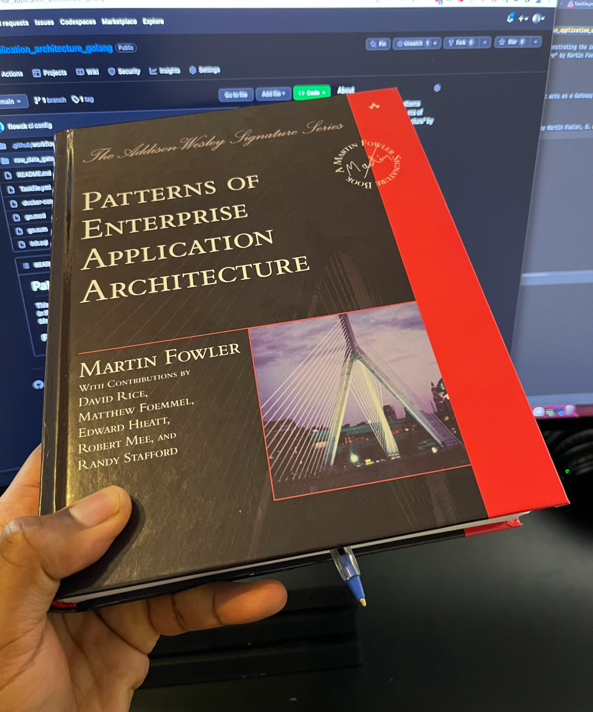

# Patterns of Enterprise Application Architecture

This repository has been created with the intent of demonstrating the implementation of some patterns described in
the book "Patterns of Enterprise Application Architecture" by Martin Fowler, D. Rice, M. Foemmel, E. Hieatt, R. Mee, and
R. Stafford.

  

## Patterns Implemented

- [Row Data Gateway](row_data_gateway): An object that acts as a Gateway (466) to a single record in a data source. There is one instance per row. [1]

## References

- [1] Patterns of Enterprise Application Architecture" by Martin Fowler, D. Rice, M. Foemmel, E. Hieatt, R. Mee, and
  R. Stafford.